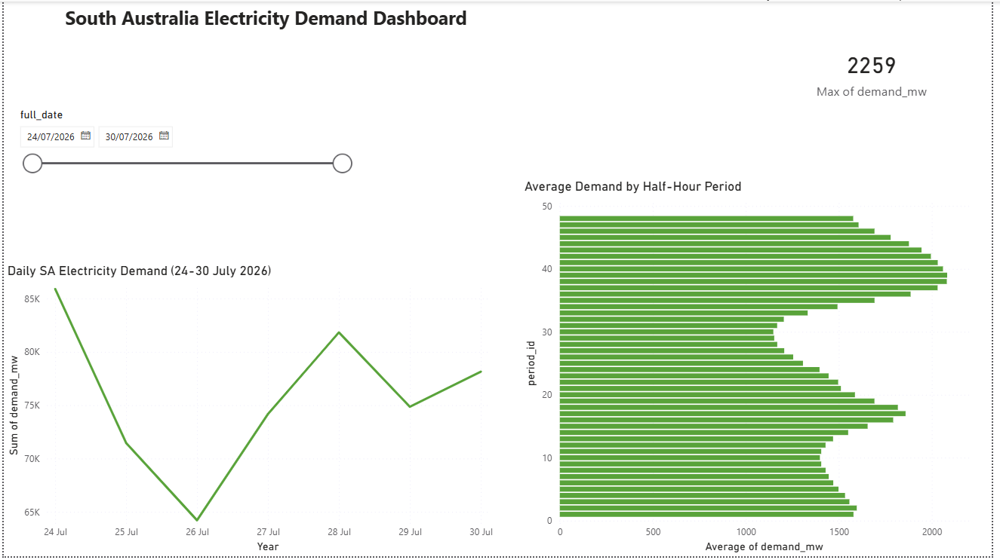

# energy-market-data-platform
# Energy Market Data Platform

An end-to-end data platform built on real Australian Energy Market Operator
(AEMO) electricity demand data for South Australia (SA1) — covering
automated extraction, ETL, dimensional modelling with dbt, automated data
quality testing, and a Power BI analytics dashboard.

This project was built to demonstrate a complete, production-style data
pipeline: from raw source data through to a governed, tested star schema
and a business-ready dashboard.

---

## Why this project

Built specifically to close skill gaps identified across real job
applications for Data Analyst / BI Analyst roles in Adelaide, SA:

| Gap identified in job applications              | How this project addresses it                          |
|---------------------------------------------------|----------------------------------------------------------|
| Dimensional / semantic modelling                  | A proper star schema built with dbt (`dim_date`, `dim_region`, `fact_demand`) |
| DataOps / version control                         | Incremental Git commit history — one commit per build phase, not a single upload |
| UAT / testing                                     | 11 automated dbt tests + a full `test_plan.md` UAT document with sign-off |
| Modern data platform tooling ("Azure", "Fabric")  | dbt Core — free, transparent, code lives directly in the repo |
| Data governance                                   | `docs/data_dictionary.md` and `docs/test_plan.md` |

The domain (electricity market data) was chosen deliberately: it draws on
prior industry experience at Ceylon Electricity Board, and is directly
relevant to the SA energy sector (e.g. ElectraNet, the state's electricity
transmission network operator).

---

## Architecture

```
AEMO NEMWEB (public data)
        │
        ▼
  Python extraction  ──────────────►  data/raw/  (CSV)
        │
        ▼
  Python ETL / cleaning  ──────────►  data/warehouse.db  (SQLite)
        │
        ▼
  dbt star schema
     ├── stg_demand      (staging)
     ├── dim_date        (dimension)
     ├── dim_region      (dimension)
     └── fact_demand     (fact table)
        │
        ├──► dbt tests (11 automated data quality checks)
        │
        ▼
  CSV export  ──────────────────────►  powerbi/data/
        │
        ▼
  Power BI dashboard  (powerbi/energy_demand_dashboard.pbix)
```

---

## Tech stack

| Layer            | Tool                     |
|-------------------|--------------------------|
| Extraction        | Python (`requests`, `pandas`) |
| ETL / warehouse    | Python, SQLite            |
| Dimensional modelling | dbt Core (SQL)          |
| Data quality testing | dbt tests (schema + custom) |
| Visualisation      | Power BI                 |
| Version control    | Git / GitHub              |

---

## Data source

- **Source:** [AEMO NEMWEB](https://nemweb.com.au/Reports/Current/HistDemand/) — publicly available historical electricity demand data
- **Region:** SA1 (South Australia)
- **Granularity:** Half-hourly settlement periods (48 per day)
- **Scope in this build:** 7 days of history (24–30 July 2026), designed to scale to any date range by changing one config value in the extraction script

---

## Project structure

```
├── data/
│   ├── raw/                     # Extracted CSVs (Phase 1)
│   └── warehouse.db             # SQLite warehouse (Phase 2)
├── pipeline/
│   ├── extract_aemo.py          # Phase 1: AEMO extraction
│   ├── load_to_db.py            # Phase 2: ETL / clean / load
│   └── export_for_powerbi.py    # Phase 5 prep: export star schema to CSV
├── energy_market/                # dbt project (Phase 3 & 4)
│   ├── models/
│   │   ├── staging/
│   │   │   ├── sources.yml
│   │   │   └── stg_demand.sql
│   │   └── marts/
│   │       ├── dim_date.sql
│   │       ├── dim_region.sql
│   │       ├── fact_demand.sql
│   │       └── schema.yml       # data quality tests
│   └── tests/
│       └── assert_demand_not_negative.sql
├── docs/
│   └── test_plan.md             # UAT test plan (Phase 4)
├── powerbi/
│   ├── data/                    # CSV exports for Power BI
│   └── energy_demand_dashboard.pbix
└── README.md
```

---

## How to run this project

**1. Extract raw AEMO data**
```bash
python pipeline/extract_aemo.py
```

**2. Clean and load into the SQLite warehouse**
```bash
python pipeline/load_to_db.py
```

**3. Build the dbt star schema**
```bash
cd energy_market
dbt run
```

**4. Run data quality tests**
```bash
dbt test
```

**5. Export tables for Power BI**
```bash
cd ..
python pipeline/export_for_powerbi.py
```

**6. Open the dashboard**
Open `powerbi/energy_demand_dashboard.pbix` in Power BI Desktop.

---

## Data quality testing

11 automated tests cover completeness, uniqueness, referential integrity,
and a custom business rule (demand can never be negative). Full detail
and sign-off is documented in [`docs/test_plan.md`](docs/test_plan.md).

```
Done. PASS=11 WARN=0 ERROR=0 SKIP=0 NO-OP=0 TOTAL=11
```

---

## Dashboard

The Power BI dashboard (`powerbi/energy_demand_dashboard.pbix`) includes:
- Daily demand trend line
- Average demand by half-hour period (shows the daily peak/off-peak curve)
- Peak demand KPI card
- Interactive date range slicer

---

## Honest scope notes

- This build covers a 7-day window of SA1 data to demonstrate the full
  pipeline end-to-end. The extraction script's `DAYS_TO_PULL` setting can
  be increased to pull a longer history with no other code changes.
- `dim_region` currently contains a single region (SA1). The model is
  written generically so it will automatically populate additional NEM
  regions (NSW1, VIC1, QLD1, TAS1) if the extraction script is pointed at
  more regions in future.
- Price data and generation-by-fuel-type data are natural next additions
  but are out of scope for this build.

---
## Dashboard



The Power BI dashboard (`powerbi/energy_demand_dashboard.pbix`) includes:
- Daily demand trend line
- Average demand by half-hour period (shows the daily peak/off-peak curve)
- Peak demand KPI card
- Interactive date range slicer


## Author

**Anne Subashini Sritharan**
Data Analyst — Adelaide, SA
[GitHub](https://github.com/subashinijaya)
